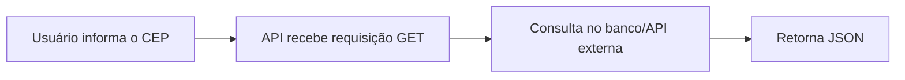

# API REST de CEP 
 
## API REST desenvolvida em PHP para consulta de endereços a partir de um CEP utilizando requisições GET.
A API retorna informações como: CEP, logradouro, bairro, cidade, estado e país.
O projeto utiliza php, MySQL, Xampp, API externa de CEP, e banco de dados MySQL.

## instruções de utilização

Abrir o link do repósitório do GitHub enviado.

### Configurar o banco de dados
encontrar e abrir a pasta "banco" para obter o código correto do banco de dados do projeto. Selecionar dentro da pasta api-cep o arquivo nomeado como "banco.sql" e copiar o código de criação da tabela e de inserção dos dados (CREATE TABLE & INSERT INTO 'endereco').
### Iniciar o Xampp 
Executar o Xampp na máquina, iniciar os serviços Apache e MySQL e abrir em localhost no navegador a partir do comando "admin" no MySQL. Após isso, colar o código copiado do arquivo da pasta banco na área de "SQL" do próprio xampp. 


## Instruções de uso
abrir em localhost o seguinte link: 

## Linguagens


## Autores 
Mateus Carlos Romano - DS3
Pedro Agostinho Carrero - DS3
Talita de Assis Godoy - DS3


# 📍 API REST de CEP

<div align="center">


# 🚀 API REST de Consulta de CEP

### API desenvolvida em PHP para consulta de endereços utilizando CEP via requisições HTTP GET.

<p align="center">
  
  
  
  
  
</p>

</div>

---

# 📖 Sobre o Projeto

Esta API REST foi desenvolvida com o objetivo de realizar consultas de endereços através de um CEP informado pelo usuário.

O sistema utiliza:

- ✅ PHP
- ✅ MySQL
- ✅ XAMPP
- ✅ API Externa de CEP
- ✅ Arquitetura REST
- ✅ Requisições GET

A aplicação retorna dados completos como:

| Campo | Descrição |
|---|---|
| CEP | Código postal |
| Logradouro | Nome da rua |
| Bairro | Bairro do endereço |
| Cidade | Cidade correspondente |
| Estado | UF do estado |
| País | País do endereço |

---

# ✨ Funcionalidades

✅ Consulta de CEP em tempo real  
✅ Retorno de dados em JSON  
✅ Integração com banco de dados MySQL  
✅ Estrutura REST API  
✅ Fácil configuração  
✅ Projeto acadêmico e didático  
✅ Integração com API externa  

---

# 🖼️ Estrutura do Projeto

```bash
api-cep/
│
├── api/
│   └── index.php
│
├── banco/
│   └── banco.sql
│
├── config/
│   └── conexao.php
│
├── assets/
│   └── imagens/
│
└── README.md
```

---

# ⚙️ Tecnologias Utilizadas

| Tecnologia | Função |
|---|---|
| PHP | Backend da aplicação |
| MySQL | Banco de dados |
| XAMPP | Servidor local |
| REST API | Comunicação HTTP |
| JSON | Estrutura de retorno |
| API de CEP | Consulta externa |

---

# 🚀 Como Executar o Projeto

## 1️⃣ Clonar o Repositório

```bash
git clone LINK_DO_REPOSITORIO
```

---

## 2️⃣ Mover a Pasta para o XAMPP

Copie a pasta do projeto para:

```bash
C:\xampp\htdocs\
```

---

## 3️⃣ Iniciar o XAMPP

Abra o **XAMPP Control Panel** e inicie os serviços:

- Apache
- MySQL

---

# 🗄️ Configuração do Banco de Dados

## 📌 Passo a passo

### 1. Abrir o phpMyAdmin

No navegador, acesse:

```bash
http://localhost/phpmyadmin
```

---

### 2. Criar o banco de dados

Crie um banco chamado:

```sql
api_cep
```

---

### 3. Importar o banco.sql

Entre na pasta:

```bash
banco/
```

Copie o conteúdo do arquivo:

```bash
banco.sql
```

Cole na aba **SQL** do phpMyAdmin e execute.

---

# 📦 Estrutura da Tabela

```sql
CREATE TABLE endereco (
    id INT PRIMARY KEY AUTO_INCREMENT,
    cep VARCHAR(8) NOT NULL,
    logradouro VARCHAR(255),
    bairro VARCHAR(255),
    cidade VARCHAR(255),
    estado VARCHAR(2),
    pais VARCHAR(100)
);
```

---

# 🌐 Endpoint da API

## 📍 Consulta GET

```http
GET /api/index.php?cep=13175667
```

---

# 🔥 Exemplo de Uso

Abra no navegador:

```bash
http://localhost/api-cep/api/index.php?cep=13175667
```

---

# 📦 Exemplo de Retorno JSON

```json
{
  "cep": "13175667",
  "logradouro": "Avenida Ipê Amarelo",
  "bairro": "Parque Villa Flores",
  "cidade": "Sumaré",
  "estado": "SP",
  "pais": "Brasil"
}
```

---

# 🧠 Fluxo da Aplicação



---

# 🔐 Validações Implementadas

✅ Verificação de CEP vazio  
✅ Consulta segura ao banco  
✅ Retorno em JSON  
✅ Tratamento básico de erros  

---

# 💻 Linguagens Utilizadas

<div align="center">


</div>

---

# 📈 Melhorias Futuras

- 🔎 Busca automática em API externa
- 📱 Interface web responsiva
- ⚡ Sistema de cache
- 🔐 Autenticação JWT
- 📄 Swagger Documentation
- ☁️ Deploy online
- 🧪 Testes automatizados

---

# 📚 Objetivo Acadêmico

Projeto desenvolvido para fins educacionais e acadêmicos visando o aprendizado de:

- APIs REST
- PHP Backend
- Integração com banco de dados
- Consumo de APIs externas
- Estruturação de projetos web

---

# 👨‍💻 Autores

<div align="center">

## Mateus Carlos Romano — DS3

## Pedro Agostinho Carrero — DS3

## Talita de Assis Godoy — DS3

</div>

---

# ⭐ Contribuição

Caso queira contribuir:

1. Faça um Fork
2. Crie uma branch
3. Commit suas alterações
4. Abra um Pull Request

---

# 📄 Licença

Este projeto está sob a licença MIT.

---

<div align="center">

# ⭐ Se gostou do projeto, deixe uma estrela no repositório!


</div>

